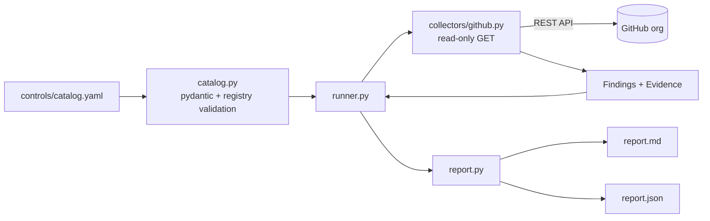

# agent-sec-lab

Security engineering lab with two deliverables:

1. **Threat model** for a multi-tenant platform that executes untrusted, LLM-generated agent
   code in sandboxes and processes customer data → [`docs/threat-model/`](docs/threat-model/README.md)
2. **`agentsec`** — a controls-as-code CLI that maps SOC 2 / ISO 27001 controls to read-only
   technical checks against a GitHub organisation and emits an audit-friendly report.

**Non-goals:** not a compliance certification tool, not an audit opinion, not production-hardened.
Framework mappings are informal ([rationale](docs/controls-mapping.md)).

## Quickstart

```bash
python -m venv .venv && . .venv/bin/activate      # Python 3.11+
pip install -e ".[dev]"

agentsec validate --catalog controls/catalog.yaml

export GITHUB_TOKEN=...                            # fine-grained, read-only, YOUR test org only
agentsec run --catalog controls/catalog.yaml --target github --org <YOUR_TEST_ORG> --out reports/
```

Output: `reports/report.md` and `reports/report.json`.

| Exit code | Meaning |
|---|---|
| 0 | No FAIL/ERROR at or above `--fail-on` (default `high`) |
| 1 | At least one FAIL at or above `--fail-on` |
| 2 | No FAIL, but at least one ERROR at or above `--fail-on` |
| 3 | Setup error (missing token, invalid catalog, unsupported target) |

### Record and replay

```bash
# live run + save minimised, pseudonymised API responses as a reusable fixture
agentsec run --org <YOUR_TEST_ORG> --org-alias demo-org \
  --record tests/fixtures/github/recorded/demo.json --out reports/

# offline run at any time, no token, against a recorded or synthetic fixture
agentsec run --replay tests/fixtures/github/recorded/demo.json --out reports/
agentsec run --replay tests/fixtures/github/org_scenario.json --out reports/   # SYNTHETIC
```

Replay is strict: a request path missing from the fixture yields `ERROR`, never a guessed
result. The report records its data source (`live` / `replay:<file> (<kind>)`).
Details: [`tests/fixtures/github/recorded/README.md`](tests/fixtures/github/recorded/README.md).

### Token permissions

Fine-grained personal access token, resource owner = the test org, all repositories, **read-only**:

| Scope | Permission | Used by |
|---|---|---|
| Repository | Metadata: read | repo listing, rulesets |
| Repository | Contents: read | workflows (SC-01), CODEOWNERS (CM-02) |
| Repository | Administration: read | branch protection (CM-01), Dependabot alerts (VM-01), repo workflow permissions (AC-03), `security_and_analysis` (DP-01) |
| Organization | Administration: read | org workflow permissions (AC-03), 2FA requirement (AC-01) |
| Organization | Members: read | owner count (AC-04) |

`ASSUMPTION`: this permission set is derived from the GitHub REST API documentation and has not
yet been verified against a live org. Missing permissions surface as `ERROR`, never as `PASS`.

## Architecture



- `controls/catalog.yaml` — control → check definitions; `controls/catalog.schema.json` is
  generated from the pydantic models (`agentsec schema`) and kept in sync by a test.
- The GitHub client issues only `GET` requests. Rate limits, 403s and transport errors become
  `ERROR` findings. The token is never written to reports.

## Controls (GitHub, phase 1)

| ID | Check | Severity |
|---|---|---|
| CM-01 | Branch protection / ruleset with required reviews on default branch | high |
| AC-01 | 2FA required for org members | critical |
| DP-01 | Secret scanning + push protection | high |
| VM-01 | Dependabot alerts | medium |
| AC-02 | No public repos unless allowlisted | high |
| SC-01 | Actions pinned to full commit SHAs | medium |
| AC-03 | Default `GITHUB_TOKEN` read-only, no PR self-approval | high |
| CM-02 | CODEOWNERS present and valid | low |
| AC-04 | Org owner count within range | medium |

## Threat model summary

33 threats (STRIDE per trust boundary, mapped to MITRE ATT&CK / ATLAS where applicable),
22 mitigations, explicit residual risk. Highest residual risk: prompt injection → tool abuse
and zero-day sandbox escape. → [docs/threat-model](docs/threat-model/README.md)

## Sample report

[`examples/sample-report.md`](examples/sample-report.md) — **SYNTHETIC EXAMPLE** generated from
test fixtures (`python examples/generate_synthetic.py`), not from a real org.

## Development

```bash
ruff check . && ruff format --check . && mypy && pytest
pre-commit install          # ruff, gitleaks, hygiene hooks
```

CI: lint, type check, tests (3.11/3.12), catalog validation, `pip-audit`, gitleaks over full
history (checksum-pinned binary). All third-party actions are pinned to commit SHAs.

## Limitations and safe use

- Run only against organisations you own or are explicitly authorised to assess.
- Checks read effective configuration at a point in time; they do not prove operating
  effectiveness over a period.
- Test fixtures: hand-written synthetic scenario plus optional recorded fixtures from a live
  test org (`--record`); see `tests/fixtures/github/`.
- Azure collector (phase 2) is not implemented.

## License

Apache-2.0
