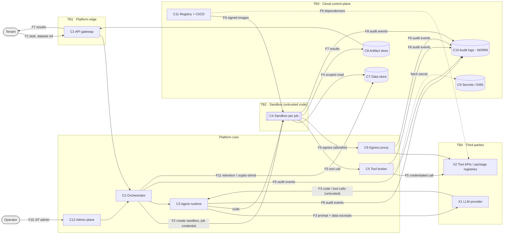

# Data-flow diagram

Flow IDs (F1–F11) and components (C*/X*) are defined in [architecture.md](architecture.md).
Dashed boxes are trust boundaries.

```mermaid
flowchart LR
    tenant([Tenant]):::ext
    operator([Operator]):::ext

    subgraph TB1["TB1 · Platform edge"]
        C1[C1 API gateway]
    end

    subgraph CORE["Platform core"]
        C2[C2 Orchestrator]
        C3[C3 Agent runtime]
        C5[C5 Tool broker]
        C6[C6 Egress proxy]
        C12[C12 Admin plane]
    end

    subgraph TB2["TB2 · Sandbox (untrusted code)"]
        C4[[C4 Sandbox per job]]
    end

    subgraph TB3["TB3 · Cloud control plane"]
        C7[(C7 Data store)]
        C8[(C8 Artifact store)]
        C9[(C9 Secrets / KMS)]
        C10[(C10 Audit logs · WORM)]
        C11[C11 Registry + CI/CD]
    end

    subgraph TB4["TB4 · Third parties"]
        X1[X1 LLM provider]
        X2[X2 Tool APIs / package registries]
    end

    tenant -- "F1 task, dataset ref" --> C1
    C1 --> C2
    C2 -- "F2 create sandbox, job credential" --> C4
    C2 --> C3
    C3 -- "F3 prompt + data excerpts" --> X1
    X1 -- "F3 code / tool calls (untrusted)" --> C3
    C3 -- "code" --> C4
    C4 -- "F4 scoped read" --> C7
    C4 -- "F5 tool call" --> C5
    C5 -- "F5 credentialed call" --> X2
    C5 -. "fetch secret" .-> C9
    C4 -- "F6 egress (allowlist)" --> C6
    C6 --> X2
    C4 -- "F7 results" --> C8
    C8 --> C1
    C1 -- "F7 results" --> tenant
    C2 & C3 & C4 & C5 & C6 -- "F8 audit events" --> C10
    C11 -- "F9 signed images" --> C4
    C11 -. "F9 dependencies" .-> X2
    operator -- "F10 JIT admin" --> C12
    C12 --> C2
    C2 -- "F11 retention / crypto-shred" --> C7

    classDef ext fill:#eee,stroke:#555
```
